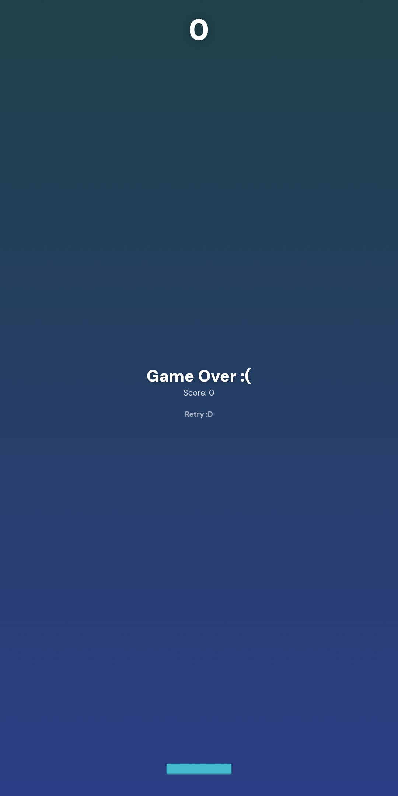
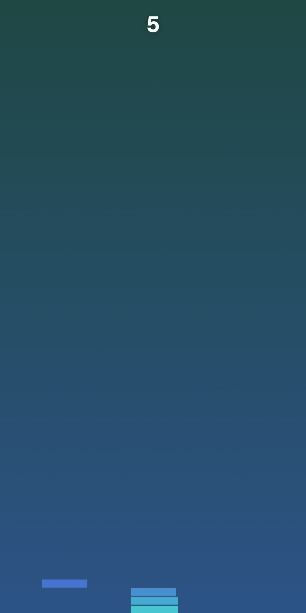

# Just One More Block

A minimalist browser game built with HTML5 Canvas and vanilla JavaScript.

The rules are simple: Stack each moving block as accurately as you can. 
Every imperfect placement trims the next block down, making every round a little more challenging than the last.

It starts easy.

Then you tell yourself: *Just one more block ;-;*

## Play the Game

Live link: https://notthatslayer.github.io/stack/

> Best experienced on a phone.

## Preview

  
  

## Features

- Built entirely with HTML5 Canvas
- Smooth camera movement
- Progressive difficulty
- Random color palette every game
- Touch and keyboard controls
- Lightweight with no game engine

## Tech Stack

- HTML5
- CSS3
- JavaScript
- HTML5 Canvas

## Controls

### Mobile
Tap anywhere to place the block.

### Desktop
Click anywhere or press the `Space` key.

## How It Works

Each new block moves horizontally across the screen.

When you place it:

- A perfect placement keeps the block size unchanged.
- An imperfect placement trims off the overhanging section.
- Miss the stack completely, and it's game over.

As the score increases, the blocks move faster, making precise timing much harder.

## Why I Built This

After recreating the "Red Light, Green Light" game, I wanted to build something different.

This time, I focused less on visuals and more on gameplay. The goal was to recreate that satisfying "one more try" feeling with nothing more than HTML Canvas and a few hundred lines of JavaScript.

## Feedback

If you have ideas for improvements or somehow manage to get a ridiculously high score, I'd love to hear about it! ^_^

## Author

Built with love by **Tayyaba Shaikh :)*
